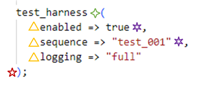

.. _configuring-multiline-constraint-rules:

Configuring Concurrent Procedure Call Statement Rules
-----------------------------------------------------

There are rules which will check indent and formatting of constraints as part of a :code:`concurrent_procedure_call_statement`:

.. code-block:: text

   concurrent_procedure_call_statement ::=
       [ label : ] [ postponed ] procedure_call ;

   procedure_call ::= procedure_name [ ( actual_parameter_part ) ]

   actual_parameter_part ::= parameter_association_list

   association_list ::=
       association_element { , association_element }

   association_element ::=
       [ formal_part => ] actual_part

There are separate rules for the structure of the constraint and the indenting.
Both rules are required to ensure proper formatting of concurrent procedure call statements.

There are several options to the structure rules:

.. |values| replace::
   :code:`add_new_line`, :code:`remove_new_line`, :code:`ignore`

.. |values2| replace::
   :code:`remove_new_line`, :code:`ignore`

.. |purple_hexa_star| image:: img/purple_hexa_star.png

.. |orange_triangle| image:: img/orange_triangle.png

.. |add_new_line| replace::
   The setting :code:`add_new_line` enforces a carriage return (alias "new line") [and, consequently by indentation rules kicking in, also (indirectly) enforces the indentation of the new line]

.. |remove_new_line| replace::
   The setting :code:`remove_new_line` enforces the removal of any potential space and carriage return

.. |ignore| replace::
   The setting :code:`ignore` disables the option and hence no formatting check is done at all: spaces and new lines can be anything

.. |default_remove_new_line| replace::
   :code:`remove_new_line`

+---------------------------------------+--------------------+-----------+------------------------+----------------------------+----------------------------+
| Option                                | Symbol             | Values    | Structural Element     | Default Value              | Description                |
+=======================================+====================+===========+========================+============================+============================+
| :code:`first_open_paren`              | |green_diamond|    | |values|  | opening parenthesis    | |default_remove_new_line|  | * |add_new_line|           |
+---------------------------------------+--------------------+-----------+------------------------+----------------------------+ * |remove_new_line|        |
| :code:`last_open_paren`               | |red_penta_star|   | |values|  | closing parenthesis    | |default_remove_new_line|  | * |ignore|                 |
+---------------------------------------+--------------------+-----------+------------------------+----------------------------+                            |
| :code:`association_element`           | |orange_triangle|  | |values|  | association element    | |default_remove_new_line|  |                            |
+---------------------------------------+--------------------+-----------+------------------------+----------------------------+----------------------------+
| :code:`association_list_comma`        | |purple_hexa_star| | |values2| | comma                  | |default_remove_new_line|  |                            |
+---------------------------------------+--------------------+-----------+------------------------+----------------------------+----------------------------+

The following figure illustrates where the options will be applied in an concurrent procedure call.

The following configuration replicates the above code snippet.

.. code-block:: yaml

   rule :
     concurrent_procedure_call_003:
        first_open_paren : 'remove_new_line'
        last_close_paren : 'add_new_line'
        association_list_comma : 'remove_new_line'
        association_element: 'add_new_line'

.. NOTE:: All examples use the above configuration.

Example: :code:`first_open_paren` set to :code:`add_new_line`
#############################################################

Setting the :code:`first_open_paren` option to :code:`remove_new_line` will result in the following formatting:

.. code-block:: vhdl

   test_harness
   (
       enabled => true,
       sequence => "test_001",
       logging => "full"
   );

Example: :code:`last_close_paren` set to :code:`remove_new_line`
################################################################

Setting the :code:`last_close_paren` option to :code:`remove_new_line` will result in the following formatting:

.. code-block:: vhdl

   test_harness(
       enabled => true,
       sequence => "test_001",
       logging => "full");

Example: :code:`association_element` set to :code:`remove_new_line`
###################################################################

Setting the :code:`association_element` option to :code:`remove_new_line` will result in the following formatting:

.. code-block:: vhdl

   test_harness(enabled => true, sequence => "test_001", logging => "full"
   );

Rules Enforcing Procedure Call Structure
########################################

* `procedure_call_003 <procedure_call_rules.html#procedure-call-003>`_
