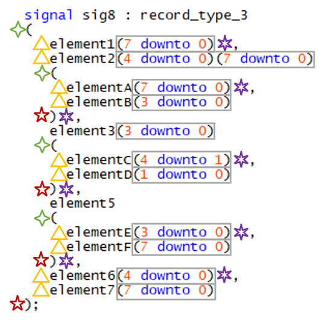

.. _configuring-selected-assignment-structure-rules:

Configuring Selected Assignment Structure Rules
-----------------------------------------------

There are rules which will check indent and formatting of selected assignments.
There are separate rules for the structure and indenting of selected assignments.
Both rules are required to ensure proper formatting of multiline constraints.

There are several options to the structure rules:

.. |values| replace::
   :code:`yes`, :code:`no`, :code:`ignore`

.. |values2| replace::
   :code:`yes`, :code:`ignore`

.. |default_yes| replace::
   :code:`yes`

.. |default_no| replace::
   :code:`no`

.. |new_line_yes_description| replace::
   :code:`yes` = Add a new line.

.. |new_line_no_description| replace::
   :code:`no` = Remove new line.

.. |new_line_ignore_description| replace::
   :code:`ignore` = Keep existing formatting.

.. |single_line_yes_description| replace::
   :code:`yes` = Keep code on a single line.

.. |single_line_ignore_description| replace::
   :code:`ignore` = Keep existing formatting.

+----------------------------------------+-----------+---------------+------------------------------------+
| Option                                 | Values    | Default Value | Description                        |
+========================================+===========+===============+====================================+
| :code:`new_line_after_with_keyword`    | |values|  | |default_no|  | * |new_line_yes_description|       |
+----------------------------------------+           +---------------+ * |new_line_no_description|        |
| :code:`new_line_before_select_keyword` |           | |default_no|  | * |new_line_ignore_description|    |
+----------------------------------------+           +---------------+                                    |
| :code:`new_line_after_select_keyword`  |           | |default_yes| |                                    |
+----------------------------------------+           +---------------+                                    |
| :code:`new_line_before_assignment`     |           | |default_no|  |                                    |
+----------------------------------------+           +---------------+                                    |
| :code:`new_line_after_assignment`      |           | |default_no|  |                                    |
+----------------------------------------+           +---------------+                                    |
| :code:`new_line_after_guarded_keyword` |           | |default_no|  |                                    |
+----------------------------------------+           +---------------+                                    |
| :code:`new_line_after_force_keyword`   |           | |default_no|  |                                    |
+----------------------------------------+           +---------------+                                    |
| :code:`new_line_after_force_mode`      |           | |default_no|  |                                    |
+----------------------------------------+           +---------------+                                    |
| :code:`new_line_after_delay_machanism` |           | |default_no|  |                                    |
+----------------------------------------+           +---------------+                                    |
| :code:`new_line_before_when_keyword`   |           | |default_no|  |                                    |
+----------------------------------------+           +---------------+                                    |
| :code:`new_line_after_when_keyword`    |           | |default_no|  |                                    |
+----------------------------------------+           +---------------+                                    |
| :code:`new_line_before_comma`          |           | |default_no|  |                                    |
+----------------------------------------+           +---------------+                                    |
| :code:`new_line_after_comma`           |           | |default_yes| |                                    |
+----------------------------------------+           +---------------+                                    |
| :code:`new_line_before_semicolon`      |           | |default_no|  |                                    |
+----------------------------------------+-----------+---------------+------------------------------------+
| :code:`single_line_delay_mechanism`    | |values2| | |default_yes| | * |single_line_yes_description|    |
+----------------------------------------+           +---------------+ * |single_line_ignore_description| |
| :code:`single_line_with_expression`    |           | |default_yes| |                                    |
+----------------------------------------+           +---------------+                                    |
| :code:`single_line_when_expression`    |           | |default_yes| |                                    |
+----------------------------------------+           +---------------+                                    |
| :code:`single_line_when_choices`       |           | |default_yes| |                                    |
+----------------------------------------+-----------+---------------+------------------------------------+

The following figure illustrates a multiline constraint in a signal declaration and where the options will be applied.
The same structure applies for constraints in constant and variable declarations.

The following configuration for signals replicates the above code snippet.
The corresponding configuration for constants and variables can be identical or different.

.. code-block:: yaml

   rule :
     signal_016:
        record_constraint_open_paren : 'add_new_line'
        record_constraint_close_paren : 'add_new_line'
        record_constraint_comma : 'remove_new_line'
        record_constraint_element : 'add_new_line'
        array_constraint : 'all_in_one_line'

.. NOTE:: All examples use the above configuration.

Example: :code:`record_constraint_open_paren` set to :code:`remove_new_line`
############################################################################

Setting the :code:`record_constraint_open_paren` option to :code:`remove_new_line` will result in the following formatting:

.. code-block:: vhdl

   signal sig8 : record_type_3(
     element1(7 downto 0),
     element2(4 downto 0)(7 downto 0)(
       elementA(7 downto 0),
       elementB(3 downto 0)
     ),
     element3(3 downto 0)(
       elementC(4 downto 1),
       elementD(1 downto 0)
     ),
     element5(
       elementE(3 downto 0),
       elementF(7 downto 0)
     ),
     element6(4 downto 0),
     element7(7 downto 0)
   );

Example: :code:`record_constraint_close_paren` set to :code:`remove_new_line`
#############################################################################

Setting the :code:`record_constraint_close_paren` option to :code:`remove_new_line` will result in the following formatting:

.. code-block:: vhdl

   signal sig8 : record_type_3
   (
     element1(7 downto 0),
     element2(4 downto 0)(7 downto 0)
     (
       elementA(7 downto 0),
       elementB(3 downto 0)),
     element3(3 downto 0)
     (
       elementC(4 downto 1),
       elementD(1 downto 0)),
     element5
     (
       elementE(3 downto 0),
       elementF(7 downto 0)),
     element6(4 downto 0),
     element7(7 downto 0));

Example: :code:`record_constraint_element` set to :code:`remove_new_line`
#########################################################################

Setting the :code:`record_constraint_element` option to :code:`remove_new_line` will result in the following formatting:

.. code-block:: vhdl

   signal sig8 : record_type_3
   (element1(7 downto 0), element2(4 downto 0)(7 downto 0)
     (elementA(7 downto 0), elementB(3 downto 0)
     ), element3(3 downto 0)
     (elementC(4 downto 1), elementD(1 downto 0)
     ), element5
     (elementE(3 downto 0), elementF(7 downto 0)
     ), element6(4 downto 0), element7(7 downto 0)
   );

Example: :code:`array_constraint` set to :code:`one_line_per_dimension`
#######################################################################

Setting the :code:`array_constraint` option to :code:`one_line_per_dimension` will result in the following formatting:

.. code-block:: vhdl

   signal sig8 : record_type_3
   (
     element1
       (7 downto 0),
     element2
       (4 downto 0)
       (7 downto 0)
     (
       elementA
         (7 downto 0),
       elementB
         (3 downto 0)
     ),
     element3
       (3 downto 0)
     (
       elementC
         (4 downto 1),
       elementD
         (1 downto 0)
     ),
     element5
     (
       elementE
         (3 downto 0),
       elementF
         (7 downto 0)
     ),
     element6
       (4 downto 0),
     element7
       (7 downto 0)
   );

Exceptions
##########

Exceptions to the above rules exist to allow formatting of specific structures.
These exceptions can be enabled by adding them to the :code:`exceptions` option.
The following exceptions are defined:

* :code:`keep_record_constraint_with_single_element_on_one_line`

:code:`keep_record_constraint_with_single_element_on_one_line`
^^^^^^^^^^^^^^^^^^^^^^^^^^^^^^^^^^^^^^^^^^^^^^^^^^^^^^^^^^^^^^

This exception will force a record constraint with a single element to a single line.

.. code-block:: vhdl

   signal my_sig : t_data_struct(data(7 downto 0));

Rules Enforcing Multiline Constraint Rules
##########################################

* `constant_017 <constant_rules.html#constant-017>`_
* `signal_017 <signal_rules.html#signal-017>`_
* `variable_017 <variable_rules.html#variable-017>`_
