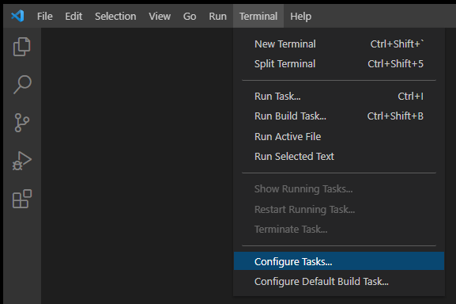
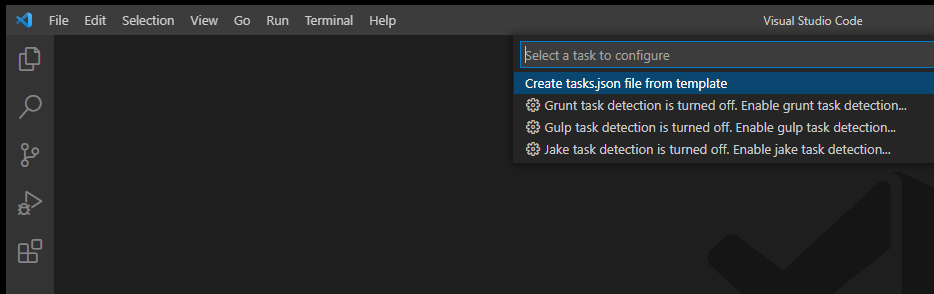
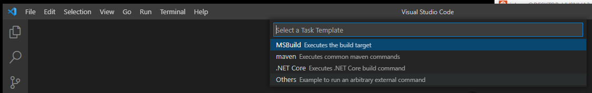
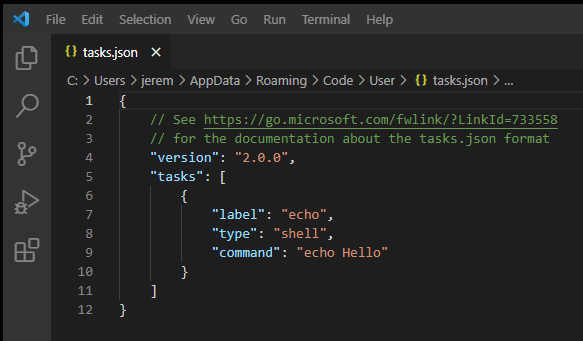
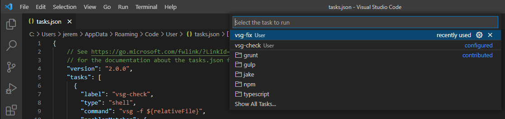
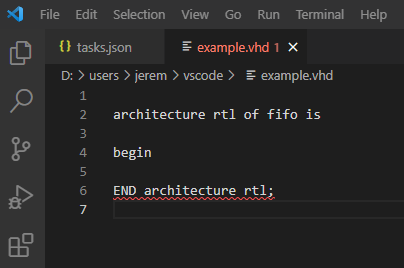
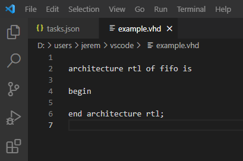

VSCode
######

Integration with VSCode is accomplished using the task interface.
This interface allows VSCode to run VSG in a shell and extract the results.

Configuring
-----------

The task interface uses the task.json file to tell VSCode how to execute a task.
The file can be generated by choosing the menu option **Terminal->Configure Tasks...**...

...then choosing **Create tasks.json file from template**...

...and finally choosing the **Others** option.

This will create a template **task.json** file:

Replace the contents of the template file with the following...

.. code-block:: json
    
    {
      // See https://go.microsoft.com/fwlink/?LinkId=733558
      // for the documentation about the tasks.json format
      "version": "2.0.0",
      "tasks": [
        {
          "label": "vsg-check",
          "type": "shell",
          "command": "vsg -f ${relativeFile}",
          "problemMatcher": {
            "owner": "vsg",
            "fileLocation": ["autoDetect", "${workspaceFolder}"],
            "pattern": [
              {
                "regexp": "^File:  ([^\\s]*)\\s*$",
                "file": 1
              },
              { // match =======
                "regexp": "^.*$"
              },
              { // match Phase
                "regexp": "^.*$"
              },
              { // match Total Rules Checked
                "regexp": "^.*$"
              },
              { // match Total Violations
                "regexp": "^.*$"
              },
              { // match Error count
                "regexp": "^.*$"
              },
              { // match Warning count
                "regexp": "^.*$"
              },
              { // match ------
                "regexp": "^.*$"
              },
              { // match Rule/severity/line/solution header
                "regexp": "^.*$"
              },
              { // match ------
                "regexp": "^.*$"
              },
              {
                "regexp": "^  ([^\\s]*_\\d*)\\s*. ([^\\s]*)\\s*.\\s*([^\\s]*) . (.*)$",
                "code": 1,
                "severity": 2,
                "location": 3,
                "message": 4,
                "loop": true
              }
            ]
          }
        },
        {
          "label": "vsg-fix",
          "type": "shell",
          "command": "vsg -f ${relativeFile} --fix",
          "problemMatcher": {
            "owner": "vsg",
            "fileLocation": ["autodetect", "${workspaceFolder}"],
            "pattern": [
              {
                "regexp": "^File:  ([^\\s]*)\\s*$",
                "file": 1
              },
              { // match =======
                "regexp": "^.*$"
              },
              { // match Phase
                "regexp": "^.*$"
              },
              { // match Total Rules Checked
                "regexp": "^.*$"
              },
              { // match Total Violations
                "regexp": "^.*$"
              },
              { // match Error count
                "regexp": "^.*$"
              },
              { // match Warning count
                "regexp": "^.*$"
              },
              { // match ------
                "regexp": "^.*$"
              },
              { // match Rule/severity/line/solution header
                "regexp": "^.*$"
              },
              { // match ------
                "regexp": "^.*$"
              },
              {
                "regexp": "^  ([^\\s]*_\\d*)\\s*. ([^\\s]*)\\s*.\\s*([^\\s]*) . (.*)$",
                "code": 1,
                "severity": 2,
                "location": 3,
                "message": 4,
                "loop": true
              }
            ]
          }
        }
      ]
    }

...and save the file:

Executing Task
--------------

The two tasks `vsg-check` and `vsg-fix` are available under the **Terminal=>Run Task...** menu option...

Keybindings
-----------

A keybinding can be created to make it easier to run the `vsg-check` and `vsg-fix` tasks.
This involves creating a `keybindings.json` file.
This file is located in the same directory as the `tasks.json` file.

Copy the following into the `keybindings.json` file...

.. code-block:: json

    [
        {"key": "ctrl+f", "command": "workbench.action.tasks.runTask", "args": "vsg-fix"},
        {"key": "ctrl+i", "command": "workbench.action.tasks.runTask", "args": "vsg-check"}
    ]

...and save it to the same directory as the `task.json` file.

Now the open file buffer can be checked for errors using `ctrl+i`...

...and then fixed by using `ctrl+f`...

